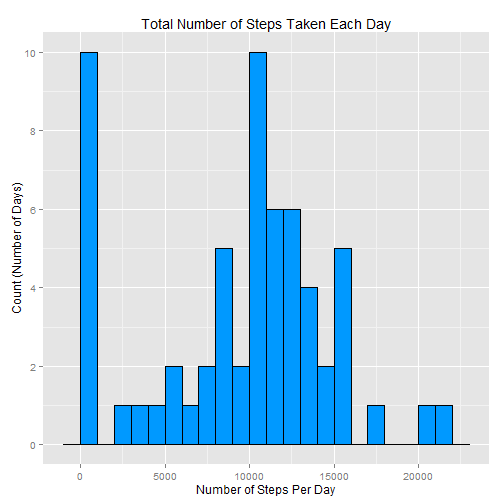
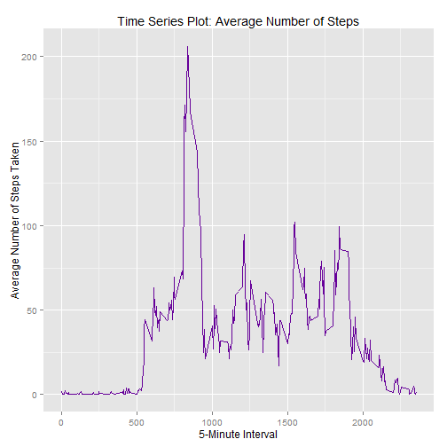
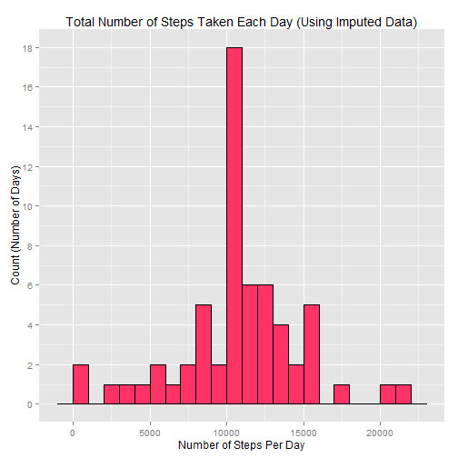
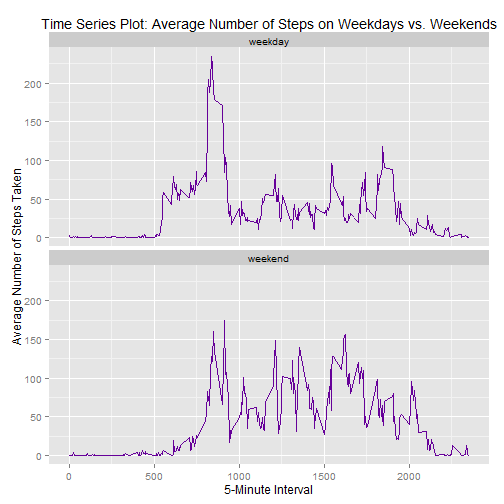

### Results From Activity Monitoring Data

------------------------------------------

###### Step 1: Data Processing

- Load necessary libraries and disable printing of scientific notation


```r
library(ggplot2)
options(scipen=999)
```

- Read in dataset (assumes data are located in the current working directory)


```r
dat <- read.csv("activity.csv")
```

- View structure of data


```r
str(dat)
```

```
## 'data.frame':	17568 obs. of  3 variables:
##  $ steps   : int  NA NA NA NA NA NA NA NA NA NA ...
##  $ date    : Factor w/ 61 levels "2012-10-01","2012-10-02",..: 1 1 1 1 1 1 1 1 1 1 ...
##  $ interval: int  0 5 10 15 20 25 30 35 40 45 ...
```

- Transform date into date variable


```r
dat$date <- as.Date(dat$date)
```

- View structure of data after date transformation


```r
str(dat)
```

```
## 'data.frame':	17568 obs. of  3 variables:
##  $ steps   : int  NA NA NA NA NA NA NA NA NA NA ...
##  $ date    : Date, format: "2012-10-01" "2012-10-01" ...
##  $ interval: int  0 5 10 15 20 25 30 35 40 45 ...
```

<br><br>

###### Step 2: What is the mean number of steps taken per day?

- Calculate the total number of steps taken per day


```r
steps_per_day <- aggregate(dat$steps, FUN=sum, by=list(dat$date), na.rm=TRUE)
names(steps_per_day) <- c("date","total")
head(steps_per_day)
```

```
##         date total
## 1 2012-10-01     0
## 2 2012-10-02   126
## 3 2012-10-03 11352
## 4 2012-10-04 12116
## 5 2012-10-05 13294
## 6 2012-10-06 15420
```

- Make a histogram of the total number of steps taken each day


```r
ggplot(steps_per_day, aes(total)) + geom_histogram(binwidth=1000, fill="#0099FF", color="black") + ggtitle("Total Number of Steps Taken Each Day") + scale_y_continuous(breaks=seq(0,10,2)) + xlab("Number of Steps Per Day") + ylab("Count (Number of Days)")
```

 

- Calculate and report the mean and median of the total number of steps taken per day


```r
mean2 <- mean(steps_per_day$total,na.rm=TRUE)
median2 <- median(steps_per_day$total,na.rm=TRUE)
```

The mean number of steps taken per day is **9354.2295082**. 

The median number of steps taken per day is **10395**. 

<br><br>

###### Step 3: What is the average daily activity pattern?

- Calculate the average number of steps taken each 5-minute interval 


```r
avg_steps <- aggregate(dat$steps, FUN=mean, by=list(dat$interval),na.rm=TRUE)
names(avg_steps) <- c("interval","average")
head(avg_steps)
```

```
##   interval   average
## 1        0 1.7169811
## 2        5 0.3396226
## 3       10 0.1320755
## 4       15 0.1509434
## 5       20 0.0754717
## 6       25 2.0943396
```

- Make a time series plot of the 5-minute interval (x-axis) and the average number of steps taken, averaged across all days (y-axis)


```r
ggplot(avg_steps, aes(x=interval, y=average)) + geom_line(color="#660099") + xlab("5-Minute Interval") + ylab("Average Number of Steps Taken") + ggtitle("Time Series Plot: Average Number of Steps")
```

 

- Which 5-minute interval contains the maximum number of steps?


```r
avg_steps_max <- avg_steps[which(avg_steps$average==max(avg_steps$average)),1]
```


The 5-minute interval containing the maximum number of steps is **835**.

<br><br>

###### Step 4: Imputing missing values

- Calculate and report the total number of missing values in the dataset


```r
total_na <- sum(is.na(dat$steps))
```

The total number of missing values is **2304**.

- Devise a strategy for filling in all of the missing values in the dataset

  - Replace missing values with the mean for that five-minute interval - merge the mean onto the full dataset


```r
new_dat <- merge(dat,avg_steps,by="interval")
str(new_dat)
```

```
## 'data.frame':	17568 obs. of  4 variables:
##  $ interval: int  0 0 0 0 0 0 0 0 0 0 ...
##  $ steps   : int  NA 0 0 0 0 0 0 0 0 0 ...
##  $ date    : Date, format: "2012-10-01" "2012-11-23" ...
##  $ average : num  1.72 1.72 1.72 1.72 1.72 ...
```

- Create 'for' loop with conditional statement - if the value is missing, set the value equal to the mean


```r
for(i in 1:nrow(dat)){
    if(is.na(new_dat[i,"steps"])){
        new_dat[i,"steps"] <- new_dat[i,"average"] 
    }
}
```

- Check there are no more missing values


```r
sum(is.na(new_dat$steps))
```

```
## [1] 0
```

- Create a new dataset that is equal to the original dataset but with the missing data filled in

+ Delete the column with the means 


```r
new_dat$average <- NULL
str(new_dat)
```

```
## 'data.frame':	17568 obs. of  3 variables:
##  $ interval: int  0 0 0 0 0 0 0 0 0 0 ...
##  $ steps   : num  1.72 0 0 0 0 ...
##  $ date    : Date, format: "2012-10-01" "2012-11-23" ...
```

+ Sort by date and interval, like original dataset


```r
new_dat <- new_dat[order(new_dat$date,new_dat$interval),]
row.names(new_dat) <- NULL
```

+ Reorder columns to mimic original dataset


```r
new_dat <- new_dat[,c(2,3,1)]
```

- Check that new dataset is equal to the old except with missing values filled in (pick random rows to check)


```r
dat[c(1,100,500,1000,2000,5000,7500),]
```

```
##      steps       date interval
## 1       NA 2012-10-01        0
## 100     NA 2012-10-01      815
## 500      0 2012-10-02     1735
## 1000     0 2012-10-04     1115
## 2000     0 2012-10-07     2235
## 5000   757 2012-10-18      835
## 7500     0 2012-10-27       55
```

```r
new_dat[c(1,100,500,1000,2000,5000,7500),]
```

```
##           steps       date interval
## 1      1.716981 2012-10-01        0
## 100  157.528302 2012-10-01      815
## 500    0.000000 2012-10-02     1735
## 1000   0.000000 2012-10-04     1115
## 2000   0.000000 2012-10-07     2235
## 5000 757.000000 2012-10-18      835
## 7500   0.000000 2012-10-27       55
```

- Calculate the total number of steps taken each day 


```r
tot_steps <- aggregate(new_dat$steps, FUN=sum, by=list(dat$date),na.rm=TRUE)
names(tot_steps) <- c("date","total")
head(tot_steps)
```

```
##         date    total
## 1 2012-10-01 10766.19
## 2 2012-10-02   126.00
## 3 2012-10-03 11352.00
## 4 2012-10-04 12116.00
## 5 2012-10-05 13294.00
## 6 2012-10-06 15420.00
```

- Make a histogram of the total number of steps taken each day


```r
ggplot(tot_steps, aes(total)) + geom_histogram(binwidth=1000, fill="#FF3366", color="black") + ggtitle("Total Number of Steps Taken Each Day (Using Imputed Data)") + scale_y_continuous(breaks=seq(0,20,2)) + xlab("Number of Steps Per Day") + ylab("Count (Number of Days)")
```

 

- Calculate and report the mean and median total number of steps taken per day


```r
mean4 <- mean(tot_steps$total,na.rm=TRUE)
median4 <- median(tot_steps$total,na.rm=TRUE)
```

The mean number of steps taken per day is **10766.1886792**. 

The median number of steps taken per day is **10766.1886792**. 

- Compare these results to the estimates from the first part of the assignment (with missing data)


```r
mean2; mean4
```

```
## [1] 9354.23
```

```
## [1] 10766.19
```

```r
median2; median4
```

```
## [1] 10395
```

```
## [1] 10766.19
```

Both the mean and the median increased as a result of imputing missing values.

<br><br>

###### Step 5: Are there differences in activity patterns between weekdays and weekends?

- Create a new factor variable in the dataset with two levels - "weekday" and "weekend" indicating whether a given date is a weekday or weekend day


```r
for(i in 1:nrow(dat)){
    if (weekdays(new_dat[i,"date"],abbreviate=TRUE) %in% c("Mon","Tue","Wed","Thu","Fri")){
        new_dat[i,"day"] <- "weekday"
    } else if (weekdays(new_dat[i,"date"],abbreviate=TRUE) %in% c("Sat","Sun")){
        new_dat[i,"day"] <- "weekend"
    }
}
```

- Make factor variable


```r
new_dat$day <- as.factor(new_dat$day)
```

- Check that variable was created correctly - compare to actual day of the week counts


```r
table(weekdays(new_dat$date))
```

```
## 
##    Friday    Monday  Saturday    Sunday  Thursday   Tuesday Wednesday 
##      2592      2592      2304      2304      2592      2592      2592
```

```r
table(new_dat$day)
```

```
## 
## weekday weekend 
##   12960    4608
```

+ We see that weekend count equals the sum of Saturday and Sunday count

- Calculate the average number of steps taken by weekday/weekend 


```r
avg_steps_wkday <- aggregate(dat$steps, FUN=mean, by=list(new_dat$interval,new_dat$day),na.rm=TRUE)
names(avg_steps_wkday) <- c("interval","day","average")
head(avg_steps_wkday)
```

```
##   interval     day   average
## 1        0 weekday 2.3333333
## 2        5 weekday 0.4615385
## 3       10 weekday 0.1794872
## 4       15 weekday 0.2051282
## 5       20 weekday 0.1025641
## 6       25 weekday 1.5128205
```

- Make a panel plot containing a time series plot of the 5-minute interval (x-axis) and the average number of steps taken, averaged across all weekday or weekend days (y-axis).


```r
ggplot(avg_steps_wkday, aes(x=interval, y=average)) + geom_line(color="#660099") + xlab("5-Minute Interval") + ylab("Average Number of Steps Taken") + ggtitle("Time Series Plot: Average Number of Steps on Weekdays vs. Weekends") + facet_wrap(~day, nrow=2)
```

 


